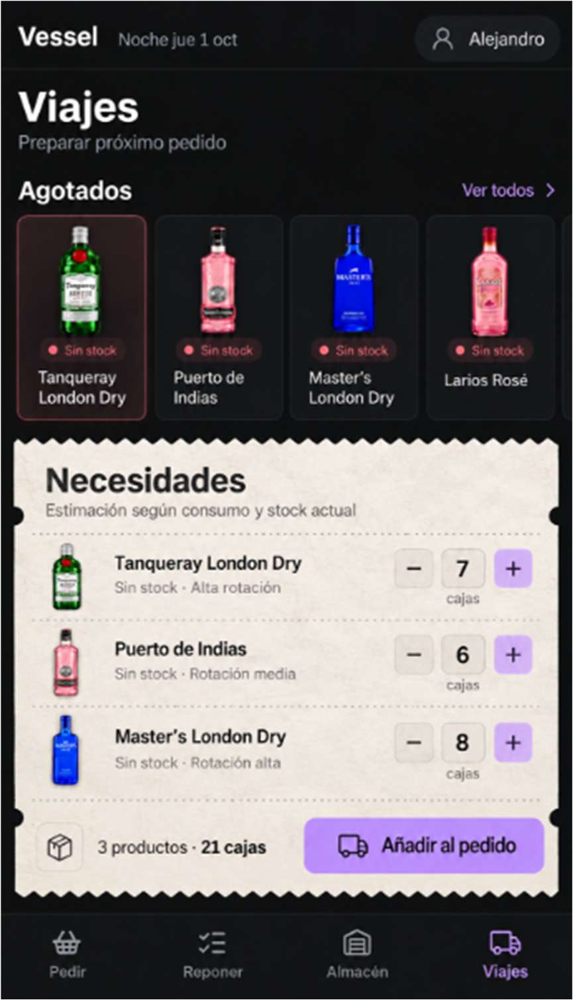
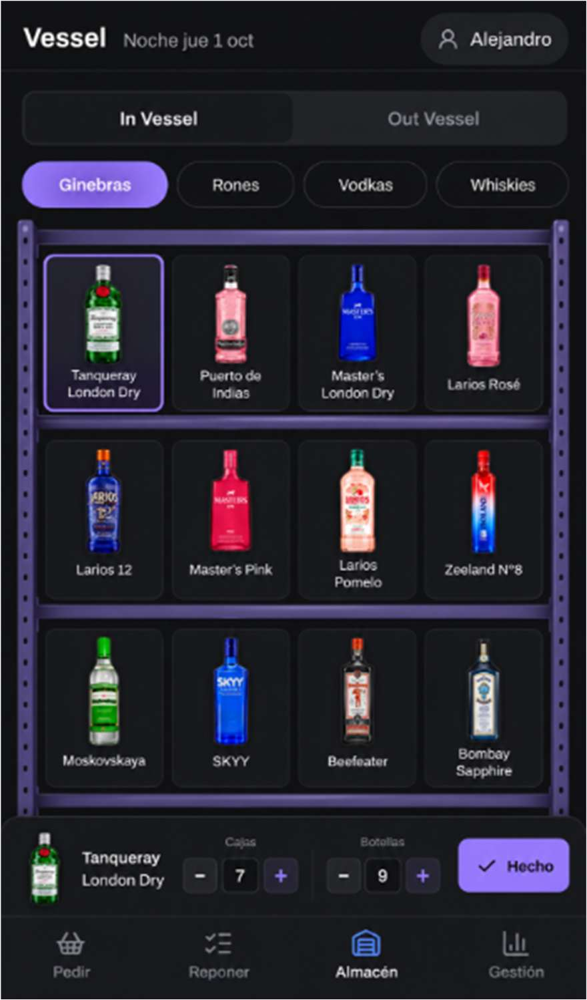
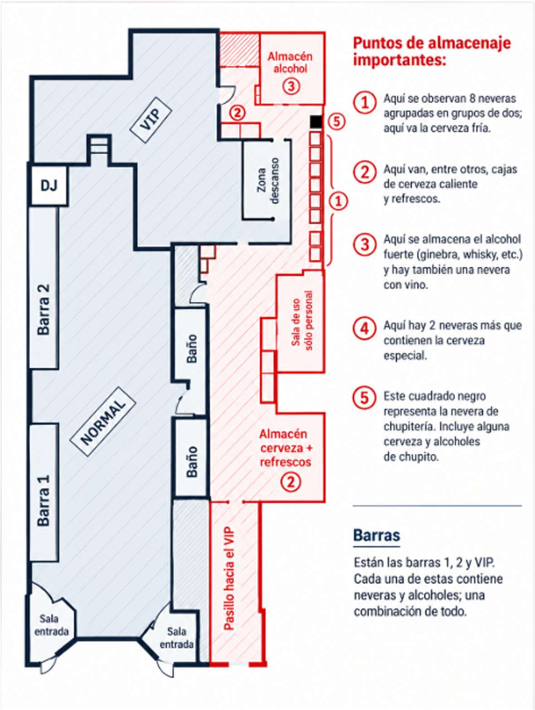

# Propuesta de producto: rediseño de la gestión de inventario en Vessel

Transcripción fiel de `Vessel_Rediseno_Inventario.docx` (en esta misma carpeta). Las imágenes del
documento están en `img/`. Las decisiones tomadas después con el usuario están en `fase-1.md` y
`fase-2.md`, y **mandan sobre este texto** cuando no coinciden.

Una estructura más visual para controlar stock, localizar descuadres y preparar reposiciones.

## Objetivo

Simplificar la gestión del stock físico del local, organizarlo según la distribución real de Vessel y
separar claramente el control de inventario de la decisión de compra.

Nueva pestaña «Viajes». Se incorpora como punto de consolidación del próximo pedido: muestra agotados
y una propuesta de necesidades que el encargado puede revisar antes de confirmar.

## 1. Resumen visual de los principales cambios

La propuesta mantiene la estética actual de Vessel, pero reduce la navegación innecesaria. El
inventario se vuelve más visual y las acciones de conteo se realizan directamente sobre el producto
seleccionado.

**Inventario visual.** En ubicaciones como el almacén de alcohol, los productos se muestran dentro de
una representación sencilla de estanterías. Las categorías se cambian mediante pestañas compactas y,
al seleccionar una botella, aparecen controles rápidos de cajas, botellas sueltas y confirmación
«Hecho».

- Menos entradas y salidas entre pantallas durante el conteo.
- Productos agrupados visualmente por categorías.
- Conteo directo de cajas y botellas sueltas desde la misma vista.

## 2. Almacén → In Vessel: mapa de puntos de almacenaje

La pestaña Almacén será la sección madre de todo el stock físico del local. Dentro de In Vessel, la
pantalla principal no abrirá directamente un inventario enorme, sino un mapa 2D reconocible de
Vessel que servirá como selector visual de las distintas ubicaciones.

**Adaptación del plano a la app.** El plano digitalizado se utilizará como base estructural,
respetando la distribución real del local y la posición aproximada de cada zona. En la aplicación se
adaptará al lenguaje visual de Vessel: fondo oscuro, líneas limpias, etiquetas compactas y zonas
seleccionables, eliminando elementos que no aporten valor al control de inventario.

Almacén → In Vessel → Mapa del local → Punto de almacenaje → Inventario específico

### Leyenda del plano (texto de la imagen)

Puntos de almacenaje importantes:

1. Aquí se observan 8 neveras agrupadas en grupos de dos; aquí va la cerveza fría.
2. Aquí van, entre otros, cajas de cerveza caliente y refrescos.
3. Aquí se almacena el alcohol fuerte (ginebra, whisky, etc.) y hay también una nevera con vino.
4. Aquí hay 2 neveras más que contienen la cerveza especial.
5. Este cuadrado negro representa la nevera de chupitería. Incluye alguna cerveza y alcoholes de
   chupito.

> **Corrección del usuario:** en el plano, las dos neveras pequeñas marcadas con un «2» arriba (junto
> a la puerta, encima de la «Zona descanso») son el punto **4**. El único punto 2 es la sala grande
> «Almacén cerveza + refrescos».

Barras: están las barras 1, 2 y VIP. Cada una de estas contiene neveras y alcoholes; una combinación
de todo.

## 3. Inventario por ubicación

Al seleccionar uno de los puntos del mapa, se abrirá únicamente el inventario correspondiente a esa
ubicación. El encargado podrá consultar el stock que debería existir allí y realizar un conteo físico
cuando sea necesario.

El primer conteo establecerá el inventario inicial del sistema. A partir de ese momento, los
movimientos registrados permitirán calcular el stock teórico de cada ubicación. No será necesario
realizar inventarios completos de forma continua: el jefe podrá repetir el conteo cuando quiera
auditar, comprobar una zona o cerrar un periodo.

## 4. Control de descuadres

La organización por ubicaciones permite localizar las diferencias entre stock teórico y stock real.
Si, por ejemplo, el sistema espera 12 cajas en una zona y durante el conteo físico aparecen 9, Vessel
podrá mostrar un descuadre de −3 cajas asociado directamente a ese punto.

De esta forma, el responsable no solo sabrá que existe una diferencia de inventario, sino también
dónde aparece físicamente dentro del local.

**Requisito del sistema.** Para que los descuadres sean fiables, los movimientos de reposición entre
almacenes, neveras y barras deben quedar registrados en Vessel. Si un producto cambia de ubicación
sin registrarse, el sistema no podrá distinguir correctamente un traslado de una pérdida.

## 5. Función de cada tipo de punto

- Barras, neveras y otros puntos operativos: consulta, conteo y detección de descuadres.
- Almacenes principales: además de lo anterior, pueden participar en la planificación del próximo
  pedido.
- El mapa funciona como selector de ubicación; cada punto abre su propio inventario específico.

## 6. Inventario visual de productos

En determinadas ubicaciones, especialmente en el almacén de alcohol, el inventario utilizará la
interfaz visual de estanterías mostrada anteriormente. Los productos aparecerán en tarjetas compactas
y organizados por grupos para facilitar su identificación.

Al seleccionar una botella, el encargado podrá modificar directamente el número de cajas y botellas
sueltas y confirmar el conteo mediante «Hecho». Así se evita abrir una ficha independiente para cada
producto.

## 7. Puntos de aprovisionamiento

No todos los puntos de almacenaje tendrán funciones de compra. Los almacenes principales
(especialmente el almacén de alcohol y el almacén de cerveza + refrescos) podrán indicar o ajustar
la cantidad de cajas que el jefe considera necesarias para el próximo pedido.

Vessel podrá generar una recomendación previa utilizando el consumo histórico y el stock disponible.
Por ejemplo, si la aplicación recomienda 10 cajas, el encargado podrá modificar la cifra a 12 antes
de consolidarla en Viajes.

**Separación de funciones.** El mapa y los inventarios controlan el stock físico. La sección Viajes
consolida la decisión final de compra. De esta forma, la aplicación evita mezclar la auditoría de
inventario con la preparación del pedido.

## 8. Nueva sección «Viajes»

Viajes reunirá las necesidades de reposición y permitirá preparar el siguiente pedido o viaje de
aprovisionamiento. En la parte superior se mostrarán los productos agotados y, debajo, una sección
«Necesidades» con estética de ticket.

Vessel recomendará cuántas cajas pedir y el encargado podrá aumentar o reducir manualmente cada
cantidad antes de incorporarla al pedido definitivo. Las cantidades destinadas a proveedores se
expresarán siempre en cajas.

## 9. Flujo general del sistema

La nueva estructura mantiene separadas tres funciones: el control del stock físico, la detección de
diferencias de inventario y la decisión final de compra.

| Paso | Función |
| --- | --- |
| Almacén | Entrada principal al stock físico |
| In Vessel | Stock dentro del local |
| Mapa del local | Selección visual de la ubicación |
| Punto de almacenaje | Inventario específico y conteo |
| Descuadre | Comparación entre stock teórico y real |
| Necesidad de reposición | Ajuste en puntos de aprovisionamiento |
| Viajes | Consolidación de las cantidades |
| Pedido final | Validación del encargado |

**Resultado esperado.** Una interfaz más sencilla, visual y relacionada directamente con la
distribución física real de Vessel. El encargado puede saber qué hay en cada ubicación, detectar
dónde aparece un descuadre y transformar las necesidades reales de stock en un pedido revisado y
controlado.
